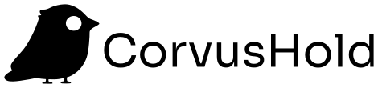

**Corvus** delivers an open-source, transparent, and auditable Infrastructure Security Automation Platform. It's currently in heavy development.
The platform is built on top of Golang and Rust for its core components.

## Adopters

Since we are still in heavy development, we have no discloseable adopters but on our internal projects, we use [warden](https://github.com/CorvusHold/warden).

## Resources

- [Website](https://corvushold.com)
- [Whitepaper](https://corvushold.com/whitepaper)
- [GitHub](https://github.com/CorvusHold)
- [Documentation](https://docs.corvushold.com)

## About us

We are a team of passionate and experienced professionals who are committed to delivering a secure and reliable Infrastructure Security Automation Platform.

Delivering from France :fr: with a global perspective :world_map:
Power by  and  with :heart: